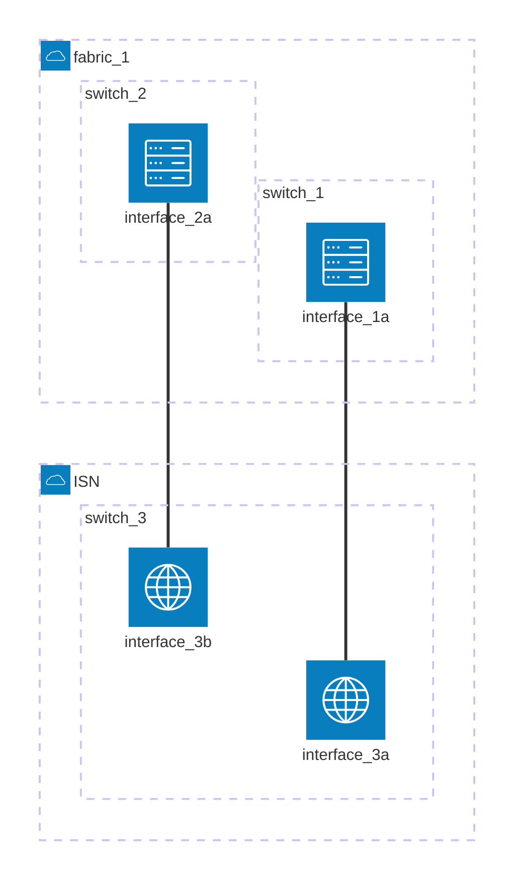

# Mermaid Diagram

```mermaid
architecture-beta
    group isn(cloud)[ISN]
      group switch_3g[switch_3] in isn
        service interface_3a(internet)[interface_3a] in switch_3g
        service interface_3b(internet)[interface_3b] in switch_3g

    group fabric_1(cloud)[fabric_1]
      group switch_1g[switch_1] in fabric_1
        service interface_1a(server)[interface_1a] in switch_1g
      group switch_2g[switch_2] in fabric_1
        service interface_2a(server)[interface_2a] in switch_2g

    interface_3a:T -- B:interface_1a
    interface_3b:T -- B:interface_2a
```