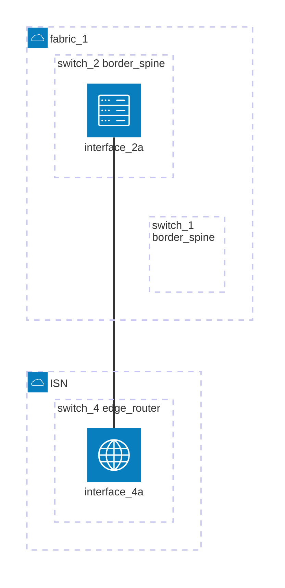

# Topology - replaced state

The topology (fabrics and switches) is not created by the test and must be
created through other means (NDFC GUI, separate Ansible scripts, etc)

[Topology Diagram](replaced.mermaid)

## ISN

- Fabric type is `Multi-Site External Network`
- The fabric is not referenced in the test, but needs to exist

### switch_4

- switch_4 role (NDFC GUI) is `Edge Router`
- switch_4 is not referenced in the test, but needs to exist

## fabric_1

- Fabric type (NDFC GUI) is `Data Center VXLAN EVPN`
- Fabric type (NDFC Template) is `Easy_Fabric`
- Fabric type (dcnm_fabric Playbook) is `VXLAN_EVPN`

### switch_1

- switch_1 role (NDFC GUI) is `Border Spine`
- switch_1 does not require an interface

### switch_2

- switch_2 role (NDFC GUI) is `Border Spine`
- interface_2a is connected to switch_4 and must be up

